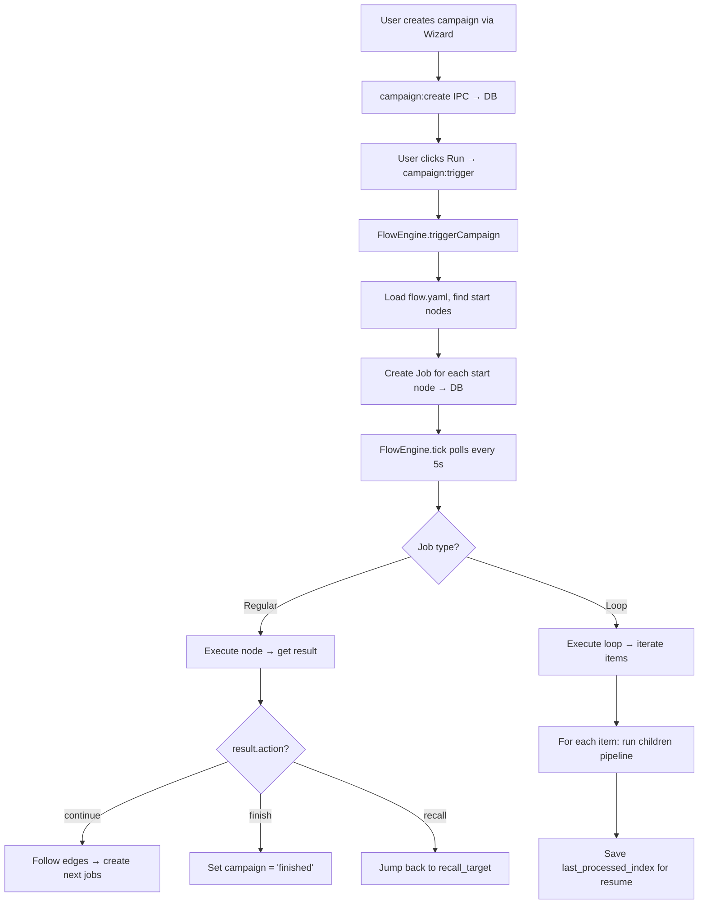

# Boembo Developer Guide

## Architecture Overview

```
src/
├── core/                    # Framework: engine, registries, contracts (NO workflow logic)
│   ├── engine/
│   │   ├── FlowEngine.ts    # Executes workflows: job polling, node execution, loop handling
│   │   ├── ExecutionLogger.ts # Logs all events to DB + emits to renderer
│   │   └── PipelineEventBus.ts # EventEmitter singleton for inter-module events
│   ├── flow/
│   │   ├── FlowLoader.ts    # Loads flow.yaml files, parses into FlowDefinition
│   │   └── ExecutionContracts.ts # TypeScript interfaces for flows, nodes, edges
│   └── nodes/
│       ├── NodeDefinition.ts # Core types: NodeManifest, NodeConfigSchema, NodeExecutionContext
│       └── NodeRegistry.ts  # Global node registry (auto-populated)
├── nodes/                   # Node implementations (auto-discovered via import.meta.glob)
│   ├── _shared/
│   │   └── timeWindow.ts    # Shared time-window utilities (normalizeTimeRanges, nextValidSlot)
│   ├── index.ts             # Auto-discovery barrel — scans ./**/index.ts, registers all nodes
│   ├── tiktok-scanner/      # Each node = folder with manifest.ts + backend.ts + index.ts
│   ├── video-scheduler/
│   ├── caption-generator/   # Generates captions from template (captionTemplate, removeHashtags, appendTags)
│   ├── tiktok-account-dedup/ # Per-account duplicate detection before publish (publish_history)
│   ├── tiktok-publisher/
│   └── ... (16 nodes total)
├── workflows/               # Workflow definitions (auto-discovered by main/index.ts)
│   └── tiktok-repost/
│       ├── flow.yaml        # Pipeline definition
│       ├── recovery.ts      # Workflow-specific crash recovery logic
│       ├── wizard.ts        # Wizard step configuration (renderer-side)
│       ├── card.tsx         # Campaign card component (renderer-side)
│       └── detail.tsx       # Campaign detail view (renderer-side)
├── shared/
│   └── ipc-types.ts         # IPC channel constants + WizardSessionData type
├── renderer/src/            # React frontend
│   ├── store/               # Redux Toolkit store
│   │   ├── campaignsSlice.ts
│   │   ├── pipelineSlice.ts
│   │   ├── nodeEventsSlice.ts
│   │   └── interactionSlice.ts
│   ├── components/wizard/   # Shared wizard step components
│   └── detail/shared/
│       └── PipelineVisualizer.tsx # Campaign pipeline visualization + InspectPanel
├── preload/
│   └── index.ts             # Exposes window.api { invoke, on, removeAllListeners }
└── main/                    # Electron main process
    ├── index.ts             # App entry: initDb, CrashRecovery, FlowLoader, FlowEngine, IPC setup
    ├── services/
    │   ├── CrashRecovery.ts      # On-startup: reset stuck jobs, delegate to per-workflow handlers
    │   ├── PublishAccountService.ts # TikTok account management via BrowserWindow login
    │   ├── BrowserService.ts      # Playwright browser pooling
    │   ├── BrowserProfileScannerService.ts # Scan existing browser profiles
    │   ├── AppSettingsService.ts   # Key-value settings in app_settings table
    │   └── TroubleshootingService.ts
    ├── ipc/                 # IPC handlers (campaigns, scanner, wizard, settings, troubleshooting)
    ├── tiktok/              # TikTok-specific modules (publisher, scanner)
    └── db/                  # SQLite database
        ├── Database.ts      # Schema + migrations
        ├── JobQueue.ts      # Job CRUD
        └── VideoQueueRepo.ts
```

---

## Core Interfaces

### `NodeDefinition` — The Node Contract

```typescript
// src/core/nodes/NodeDefinition.ts

interface NodeConfigSchemaField {
  key: string
  label: string
  type: 'string' | 'number' | 'boolean' | 'select' | 'multi_select' | 'account_picker'
  required?: boolean
  default?: any
  options?: Array<{ value: string; label: string }>
  description?: string
}

interface NodeConfigSchema {
  fields: NodeConfigSchemaField[]
}

interface NodeExecutionContext {
  campaign_id: string
  job_id?: string
  params: Record<string, any>          // Campaign params from wizard
  logger: { info(msg: string): void; error(msg: string, err?: any): void }
  onProgress(msg: string): void        // Shows status in PipelineVisualizer
}

interface NodeExecutionResult {
  data: any                            // Passed as input to the next node
  action?: 'continue' | 'recall' | 'finish'
  recall_target?: string               // instance_id to jump back to (if action='recall')
  message?: string                     // Human-readable log message
}

interface NodeManifest {
  id: string                           // e.g. 'tiktok.scanner', 'core.video_scheduler'
  name: string
  category: 'source' | 'filter' | 'transform' | 'publish' | 'control'
  icon?: string
  description?: string
  config_schema?: NodeConfigSchema     // Used by wizard auto-generation
  editable_settings?: NodeConfigSchema // Editable in visualizer InspectPanel
  on_save_event?: string               // Event triggered on save (e.g. 'reschedule')
}

interface NodeDefinition {
  manifest: NodeManifest
  execute(input: any, ctx: NodeExecutionContext): Promise<NodeExecutionResult>
}
```

### `FlowDefinition` — The Workflow Contract

```typescript
// src/core/flow/ExecutionContracts.ts

interface FlowDefinition {
  id: string
  name: string
  description?: string
  icon?: string
  color?: string
  version: string
  nodes: FlowNodeDefinition[]
  edges: FlowEdgeDefinition[]
  ui?: WorkflowUIDescriptor
}

interface FlowNodeDefinition {
  node_id: string                      // References NodeManifest.id
  instance_id: string                  // Unique within this flow (e.g. 'scanner_1')
  children?: string[]                  // Only for loop nodes — child instance_ids
  on_error?: 'skip' | 'stop_campaign' | 'retry'
  timeout?: number                     // Node-level timeout in ms
  events?: Record<string, { action: 'skip_item' | 'pause_campaign' | 'stop_campaign'; emit?: string }>
  params?: Record<string, any>         // Node-level static params (e.g. condition expressions)
  execution?: any                      // Runtime state (populated by engine)
}

interface FlowEdgeDefinition {
  from: string                         // instance_id
  to: string                          // instance_id
  when?: string                        // JS expression evaluated against result.data
}
```

---

## Database Schema

### `campaigns` table
| Column | Type | Description |
|---|---|---|
| `id` | TEXT PK | Random 8-char hex ID |
| `workflow_id` | TEXT | References flow.yaml `id` |
| `name` | TEXT | Campaign display name |
| `params` | TEXT (JSON) | All wizard settings — **single source of truth** |
| `status` | TEXT | `idle` → `active` → `paused` / `finished` / `error` / `needs_captcha` |
| `last_processed_index` | INTEGER | Loop resume checkpoint (which video index was last processed) |
| `queued_count` / `downloaded_count` / `published_count` / `failed_count` | INTEGER | Live counters |
| `created_at` / `updated_at` | INTEGER | Unix timestamps |

### `videos` table
| Column | Type | Description |
|---|---|---|
| `platform_id` | TEXT (PK) | TikTok video ID |
| `campaign_id` | TEXT (PK) | Composite PK with platform_id |
| `status` | TEXT | `queued` → `processing` → `published` / `under_review` / `failed` / `duplicate` / `skipped` |
| `publish_url` | TEXT | TikTok publish URL after upload |
| `local_path` | TEXT | Downloaded file path |
| `data_json` | TEXT (JSON) | Video metadata (caption, author, stats, generated_caption, etc.) |
| `scheduled_for` | INTEGER | Unix timestamp for when video should be published |
| `queue_index` | INTEGER | Order in the queue |

### `jobs` table
| Column | Type | Description |
|---|---|---|
| `id` | TEXT PK | UUID |
| `campaign_id` | TEXT | FK to campaigns |
| `workflow_id` | TEXT | Which flow this job belongs to |
| `node_id` | TEXT | NodeManifest.id |
| `instance_id` | TEXT | FlowNodeDefinition.instance_id |
| `type` | TEXT | Always `'FLOW_STEP'` |
| `status` | TEXT | `pending` → `running` → `completed` / `failed` |
| `data_json` | TEXT (JSON) | Input data for the node |
| `error_message` | TEXT | Error details if failed |
| `scheduled_at` / `started_at` / `completed_at` | INTEGER | Timing |

### `execution_logs` table
| Column | Type | Description |
|---|---|---|
| `id` | INTEGER PK | Auto-increment |
| `campaign_id` | TEXT | FK to campaigns |
| `job_id` / `instance_id` / `node_id` | TEXT | Which node produced this log |
| `level` | TEXT | `info` / `warn` / `error` / `debug` / `progress` |
| `event` | TEXT | Structured event name (e.g. `node:start`, `node:end`, `node:error`) |
| `message` | TEXT | Human-readable message |
| `data_json` | TEXT (JSON) | Additional structured data |

### `publish_accounts` table
| Column | Type |
|---|---|
| `id` | TEXT PK |
| `platform` | TEXT (default 'tiktok') |
| `username` / `handle` / `avatar` | TEXT |
| `cookies_json` | TEXT (JSON array of cookies) |
| `proxy` | TEXT |
| `session_status` | TEXT (`active` / `expired`) |
| `auto_caption` / `auto_tags` | INTEGER / TEXT |

### `publish_history` table
| Column | Type |
|---|---|
| `id` | TEXT PK |
| `account_id` / `account_username` | TEXT |
| `campaign_id` / `source_platform_id` | TEXT |
| `source_local_path` | TEXT |
| `file_fingerprint` / `caption_hash` / `caption_preview` | TEXT |
| `published_video_id` / `published_url` | TEXT |
| `media_signature_json` / `media_signature_version` | TEXT |
| `duplicate_reason` | TEXT |
| `status` | TEXT (`under_review` / `published` / `duplicate`) |

### `app_settings` table
| Column | Type | Description |
|---|---|---|
| `key` | TEXT PK | Setting key |
| `value_json` | TEXT | JSON-encoded value |
| `updated_at` | INTEGER | Unix timestamp |

> Used by `AppSettingsService` for storing global key-value app settings.

---

## Campaign Parameters (Source of Truth)

All backend nodes receive these via `ctx.params`. **Use these exact names — never create aliases.**

| Parameter | Type | Set By | Purpose |
|---|---|---|---|
| `name` | `string` | Step1 | Campaign display name |
| `captionTemplate` | `string` | Step1 | Caption template with `[Original Desc]`, `[Author]`, `[Tags]` |
| `removeHashtags` | `boolean` | Step1 | Strip hashtags from original caption |
| `appendTags` | `string` | Step1 | Tags to append to caption |
| `intervalMinutes` | `number` | Step4 | **Gap (minutes) between videos.** Default: `60` |
| `timeRanges` | `TimeRange[]` | Step4 | Active time windows for scheduling |
| `sources` | `Source[]` | Step2 | TikTok channels/keywords to scan |
| `selectedAccounts` | `string[]` | Step5 | Publish account IDs (round-robin) |
| `privacy` | `string` | Step5 | TikTok privacy setting. Default: `'public'` |
| `maxVideos` | `number` | Step3 | Max videos to process per run. Default: `100` |

### TimeRange shape

```typescript
interface TimeRange {
  days: number[]   // 0=Sun, 1=Mon ... 6=Sat
  start: string    // "HH:mm"
  end: string      // "HH:mm"
}
```

**Priority order:** `timeRanges` (if set) → `activeHoursStart/End/Days` (legacy) → 24/7 fallback.
Use `normalizeTimeRanges(ctx.params)` from `nodes/_shared/timeWindow.ts`.

---

## IPC Communication

### Preload Bridge

```typescript
// Renderer uses: window.api.invoke(channel, data?)  — for request/response
//                window.api.on(channel, callback)    — for push events from main
```

### IPC Channels (Request/Response — `ipcMain.handle`)

| Channel | Direction | Handler File | Description |
|---|---|---|---|
| `wizard:start` | renderer → main | `ipc/wizard.ts` | Start wizard session |
| `wizard:get-session` | renderer → main | `ipc/wizard.ts` | Get current wizard session |
| `wizard:commit-step` | renderer → main | `ipc/wizard.ts` | Save wizard step data |
| `wizard:go-back` | renderer → main | `ipc/wizard.ts` | Go to previous wizard step |
| `campaign:list` | renderer → main | `ipc/campaigns.ts` | List all campaigns |
| `campaign:get` | renderer → main | `ipc/campaigns.ts` | Get single campaign by ID |
| `campaign:create` | renderer → main | `ipc/campaigns.ts` | Create campaign from wizard |
| `campaign:delete` | renderer → main | `ipc/campaigns.ts` | Delete campaign + logs |
| `campaign:trigger` | renderer → main | `ipc/campaigns.ts` | Start/run campaign |
| `campaign:pause` | renderer → main | `ipc/campaigns.ts` | Pause campaign |
| `campaign:resume` | renderer → main | `ipc/campaigns.ts` | Resume campaign |
| `campaign:get-jobs` | renderer → main | `ipc/campaigns.ts` | Get jobs for campaign |
| `campaign:get-flow-nodes` | renderer → main | `ipc/campaigns.ts` | Get flow definition + `editable_settings` |
| `campaign:get-logs` | renderer → main | `ipc/campaigns.ts` | Get execution logs (limit optional) |
| `campaign:get-videos` | renderer → main | `ipc/campaigns.ts` | Get videos for campaign (ordered by queue_index) |
| `campaign:get-node-progress` | renderer → main | `ipc/campaigns.ts` | Get latest progress message per node instance |
| `campaign:update-params` | renderer → main | `ipc/campaigns.ts` | Merge params into campaign |
| `campaign:reschedule-all` | renderer → main | `ipc/campaigns.ts` | Recalculate all queued video times |
| `toggle-campaign-status` | renderer → main | `ipc/campaigns.ts` | Toggle active/paused |
| `flow:get-presets` | renderer → main | `ipc/campaigns.ts` | List available workflows (with node tags) |
| `flow:list` | renderer → main | `ipc/campaigns.ts` | List workflows (minimal fields) |
| `flow:get-ui-descriptor` | renderer → main | `ipc/campaigns.ts` | Get workflow UI config |
| `open-scanner-window` | renderer → main | `ipc/scanner.ts` | Open TikTok scanner popup |
| `video:reschedule` | renderer → main | `ipc/campaigns.ts` | Reschedule single video |
| `video:show-in-explorer` | renderer → main | `ipc/campaigns.ts` | Open file in system explorer |
| `account:list` | renderer → main | `ipc/settings.ts` | List publish accounts |
| `account:add` | renderer → main | `ipc/settings.ts` | Add TikTok account via login |
| `nodes:catalog` | renderer → main | `ipc/campaigns.ts`? | (defined in IPC_CHANNELS, not yet implemented) |

### Push Events (Main → Renderer via `webContents.send`)

| Event | Emitted By | Payload | Listener |
|---|---|---|---|
| `execution:log` | `ExecutionLogger.log()` | `LogEntry` full | Log viewer |
| `node:status` | `ExecutionLogger.nodeStart/End/Error` | `{ campaignId, instanceId, status, error? }` | `nodeEventsSlice.updateNodeStatus` |
| `node:progress` | `ExecutionLogger.nodeProgress` | `{ campaignId, instanceId, message }` | `nodeEventsSlice.updateNodeProgress` |
| `execution:node-data` | `ExecutionLogger.nodeData` | `{ campaignId, instanceId, data }` | Detail views |
| `node:event` | `ExecutionLogger.emitNodeEvent` | `{ campaignId, instanceId, event, data }` | Condition/notify handling |
| `pipeline:interaction_waiting` | `PipelineEventBus` | session payload | `interactionSlice` |
| `pipeline:interaction_resolved` | `PipelineEventBus` | session payload | `interactionSlice` |
| `campaign:created` | `campaigns.ts` | campaign object | Campaign list refresh |
| `campaigns-updated` | Various | — | Global campaign list refresh |
| `campaign:params-updated` | `campaigns.ts` | `{ id, params }` | Visualizer settings refresh |
| `scanner:import` | `scanner.ts` | source data | Wizard step 2 |

---

## Execution Flow



### Loop Execution Detail

```
for each item in items (starting from last_processed_index):
  1. Check campaign status (paused? → return)
  2. For each child node:
     a. If item was skipped → only run timeout/condition/notify
     b. Execute node with current data
     c. Handle result:
        - action='finish' → stop campaign
        - action='continue' + no data → mark skipped
        - Otherwise → pass data to next child
     d. On error:
        - on_error='stop_campaign' → set campaign to 'error'
        - on_error='skip' → skip item, still run timeout
  3. Save progress: UPDATE campaigns SET last_processed_index = i+1
```

### Crash Recovery (on app startup)

The recovery system is **two-tier**:

1. **Generic** (`CrashRecovery.ts`): Resets all `running` jobs to `pending`.
2. **Per-workflow** (`workflows/*/recovery.ts`): Each workflow registers a `recover(campaignId)` handler via `CrashRecoveryService.registerRecovery(workflowId, { recover })`.

#### `tiktok-repost` recovery (`src/workflows/tiktok-repost/recovery.ts`):
```
1. Find queued videos with scheduled_for < NOW → reschedule from now
2. Find under_review videos → reset to 'queued' (publisher will resume verification)
3. If no pending/running jobs → re-trigger campaign from start
```

> To add recovery for a new workflow: create `src/workflows/my-workflow/recovery.ts` exporting `recover(campaignId)`, and register it on startup.

---

## How to Write a Node

Each node is a self-contained folder under `src/nodes/`. Auto-discovered at runtime.

```
src/nodes/my-node/
├── manifest.ts    # Node metadata
├── backend.ts     # Execution logic
└── index.ts       # Entry: imports both, exports { manifest, execute } as NodeDefinition
```

### manifest.ts

```typescript
import { NodeManifest } from '../../core/nodes/NodeDefinition'

const manifest: NodeManifest = {
  id: 'my-namespace.my_node',
  name: 'My Node',
  category: 'processing',
  icon: '🔧',
  description: 'What this node does',
  // Optional: editable in visualizer
  editable_settings: {
    fields: [
      { key: 'myParam', label: 'My Param', type: 'number', default: 10 }
    ]
  },
  on_save_event: 'reschedule' // Optional: IPC event on save
}
export default manifest
```

### backend.ts

```typescript
import { NodeExecutionContext, NodeExecutionResult } from '../../core/nodes/NodeDefinition'

export async function execute(input: any, ctx: NodeExecutionContext): Promise<NodeExecutionResult> {
  ctx.onProgress('Processing...')
  ctx.logger.info('Started processing')

  // Use ONLY canonical ctx.params names — NEVER create fallbacks
  const myParam = ctx.params.myParam ?? 10

  return {
    data: result,        // Passed as input to next node
    action: 'continue',  // 'continue' | 'finish' | 'recall'
    message: 'Done',
  }
}
```

### Key Rules

- **Use only canonical `ctx.params` names.** Never add `?? ctx.params.some_legacy_alias` — this causes drift.
- **Return `{ data: null }`** to signal skip (e.g. dedup detected duplicate).
- **Throw errors** for hard failures — engine handles via `on_error` config.
- **Use `ctx.logger`**, not `console.log`. Logs go to DB + show in execution log UI.
- **Use `ctx.onProgress(msg)`** for live status in PipelineVisualizer.

---

## How to Write a Workflow

```
src/workflows/my-workflow/
├── flow.yaml        # Required: pipeline definition
├── recovery.ts      # Optional: crash recovery handler
├── wizard.ts        # Optional: wizard step config (renderer)
├── card.tsx         # Optional: campaign list card (renderer)
└── detail.tsx       # Optional: campaign detail view (renderer)
```

### flow.yaml Structure

```yaml
id: my-workflow
name: My Workflow
icon: 🔧
color: "#8b5cf6"
version: "1.0"

nodes:
  - node_id: tiktok.scanner
    instance_id: scanner_1
    timeout: 30000            # Optional: timeout in ms

  - node_id: core.video_scheduler
    instance_id: scheduler_1

  # Loop node — runs children for each item
  - node_id: core.loop
    instance_id: video_loop
    children: [check_time_1, dedup_1, downloader_1, caption_1, account_dedup_1, publisher_1]

  - node_id: core.check_in_time
    instance_id: check_time_1

  - node_id: core.caption_gen
    instance_id: caption_1

  - node_id: tiktok.account_dedup
    instance_id: account_dedup_1

  - node_id: tiktok.publisher
    instance_id: publisher_1
    on_error: skip            # 'skip' (default) | 'stop_campaign'
    events:
      captcha:detected:
        action: skip_item
        emit: campaign:needs_captcha

  # Inline node-level params (condition/notify)
  - node_id: core.condition
    instance_id: cond_violation_1
    params:
      expression: "status === 'violation'"

edges:
  - from: scanner_1
    to: scheduler_1
  - from: scheduler_1
    to: video_loop
  - from: publisher_1
    to: cond_violation_1
  - from: cond_violation_1
    to: notify_violation_1
    when: "branch === 'true'"   # JS expression against result.data
```

---

## Built-in Nodes Reference

| Node ID | Category | Purpose | Reads from `ctx.params` |
|---|---|---|---|
| `tiktok.scanner` | source | Scan TikTok channels/keywords | `sources`, `campaignType` |
| `core.video_scheduler` | control | Assign `scheduled_for` timestamps | `intervalMinutes`, `timeRanges` |
| `core.check_in_time` | control | Wait for active hours + scheduled time | `timeRanges` (via `normalizeTimeRanges`) |
| `core.deduplicator` | filter | Skip already-processed videos (by platform_id) | — |
| `core.downloader` | transform | Download video to local disk | — |
| `core.caption_gen` | transform | Generate caption from template | `captionTemplate`, `removeHashtags`, `appendTags` |
| `tiktok.account_dedup` | filter | Per-account duplicate check via publish_history (exact + AV similarity) | — |
| `tiktok.publisher` | publish | Publish video to TikTok | `selectedAccounts`, `privacy` |
| `core.timeout` | control | Wait N minutes between videos | `intervalMinutes`, `enableJitter` |
| `core.limit` | filter | Limit number of items | `maxVideos` |
| `core.condition` | control | Branch on expression | `expression` (node-level `params`) |
| `core.notify` | control | Desktop notification | `title`, `body`, `sound` (node-level `params`) |
| `core.campaign_finish` | control | Mark campaign complete | — |
| `core.quality_filter` | filter | Filter by quality criteria | — |
| `core.loop` | control | Iterate over items array, run children per item | — |
| `file.source` | source | Load videos from local files | — |

> **Note:** `tiktok-repost` flow uses **`core.caption_gen`** and **`tiktok.account_dedup`** as child nodes in the loop, between the downloader and publisher. This is the current node order:
> `check_time_1` → `dedup_1` → `downloader_1` → `caption_1` → `account_dedup_1` → `publisher_1` → `cond_violation_1` → `cond_captcha_1`

---

## Redux Store (Renderer)

| Slice | State Shape | Purpose |
|---|---|---|
| `campaigns` | Campaign list + current | Campaign CRUD state |
| `pipeline` | `tasks: Record<id, VideoTask>` | Video-level status tracking |
| `nodeEvents` | `activeNodes`, `nodeProgress`, `byCampaign` | Real-time node execution status from IPC |
| `interaction` | Interaction session data | CAPTCHA/dialog handling |

### Key interfaces in `nodeEventsSlice`:

```typescript
interface ActiveNodeInfo {
  status: 'running' | 'completed' | 'failed'
  message?: string
  jobId?: string
  error?: string
  updatedAt: number
}

interface NodeStat {
  instance_id: string
  pending: number; running: number; completed: number; failed: number; total: number
  lastStatus?: string; lastError?: string
}

interface JobSummary {
  id: string; campaign_id: string; workflow_id: string
  node_id: string; instance_id: string; type: string; status: string
  data_json: string; error_message?: string
  scheduled_at?: number; started_at?: number; completed_at?: number
}
```

---

## Error Handling

### Per-Node `on_error` (in flow.yaml)
- `skip` *(default)*: Skip current item, continue loop
- `stop_campaign`: Set campaign status to `'error'`, halt everything

### Publisher-Specific Events
The publisher does NOT throw for these — it returns structured data:
- `captcha` → flow event `captcha:detected` → `action: skip_item` → item skipped, campaign may pause
- `violation` → `{ data: { status: 'violation' } }` → triggers `cond_violation_1` branch
- `under_review` → Enters retry loop (checking content dashboard for publish confirmation)
- `duplicate` → `tiktok.account_dedup` returns `{ data: null }` → item skipped

### CAPTCHA Detection
If any node throws with `CAPTCHA` in the error message, `FlowEngine` automatically sets `campaign.status = 'needs_captcha'`.

---

## Startup Sequence

```
app.whenReady() →
  1. initDb()                           # Create/migrate SQLite tables
  2. CrashRecoveryService.recoverPendingTasks()  # Fix stuck jobs, delegate to workflow handlers
  3. flowLoader.loadAll(workflowsDir)    # Scan src/workflows/*/flow.yaml
  4. flowEngine.start()                  # Begin 5s polling loop
  5. setup*IPC()                         # Register all IPC handlers
  6. createWindow()                      # Launch Electron BrowserWindow
```

The `import '../workflows'` barrel in `index.ts` auto-imports all workflow modules (recovery, wizard, etc.) which register themselves (e.g. `CrashRecoveryService.registerRecovery(workflowId, { recover })`).

> **Note:** Node auto-discovery happens at import time (`import '../nodes'` in `index.ts`), which uses `import.meta.glob('./**/index.ts', { eager: true })` to find and register all 16 nodes.
